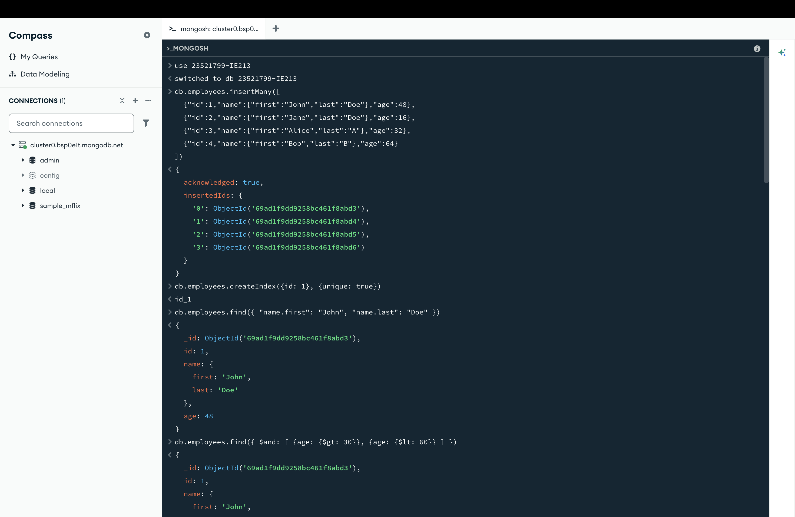
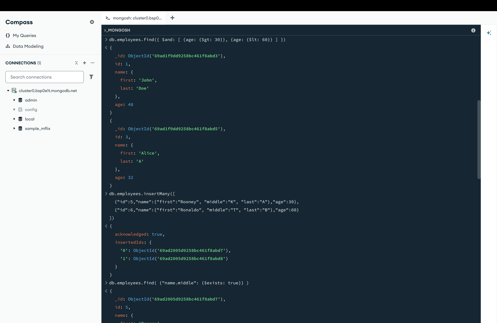
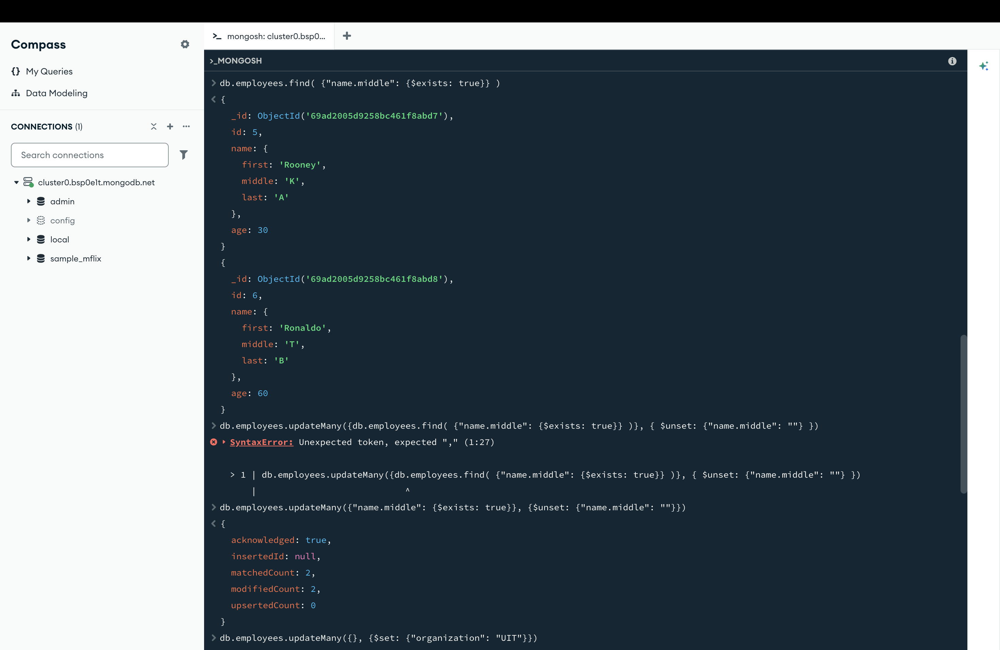
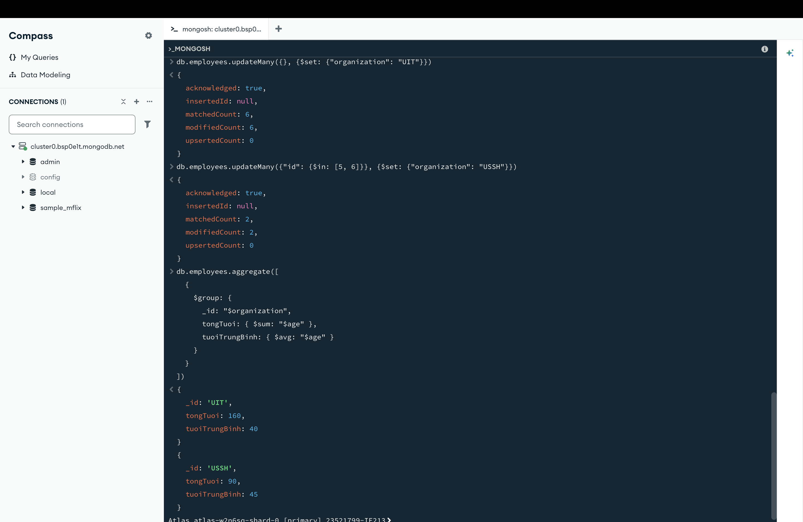

- ### Mục tiêu bài thực hành:
    + Thiết lập môi trường
    + Thực hành viết lệnh với MongoDB

- ### Công cụ / môi trường sử dụng:
    + MongoDB Atlas
    + MongoDB Compass
    + MONGOSH

- ### Những nội dung đã hoàn thành:
    + Hoàn thành toàn bộ yêu cầu cấu hình môi trường và các lệnh CRUD

- ### Những nội dung chưa hoàn thành:
    + Không có

- ### Cách chạy:
    1. Mở MongoDB Compass và kết nối với cụm Atlas.
    2. Mở terminal mongosh tích hợp trong Compass.
    3. Copy lần lượt từng câu lệnh trong file `Lab1.js` và dán vào terminal để thực thi.

- ### Kết quả đầu ra:
    
    
    
    

- ### Giải thích ngắn gọn phần chính đã thực hiện:
    + Sử dụng `insertMany` để thêm dữ liệu.
    + Sử dụng `createIndex` để tạo khóa unique cho trường `id`.
    + Sử dụng `find` kết hợp `$and`, `$exists` để lọc dữ liệu nâng cao.
    + Sử dụng `updateMany` với toán tử `$unset` (xóa trường) và `$set` (thêm/sửa trường).
    + Sử dụng Pipeline `aggregate` với `$group` để gom nhóm và tính toán (`$sum`, `$avg`).

- ### Sử dụng AI:
    + Công cụ: Gemini
    + Mục đích sử dụng: Nhờ AI giải thích lỗi, nhờ AI gợi ý cách tổ chức README
    + Phần nào được AI hỗ trợ: Giải thích lỗi bài 2.7, cách tạo liên kết từ README gốc đến README của các lab