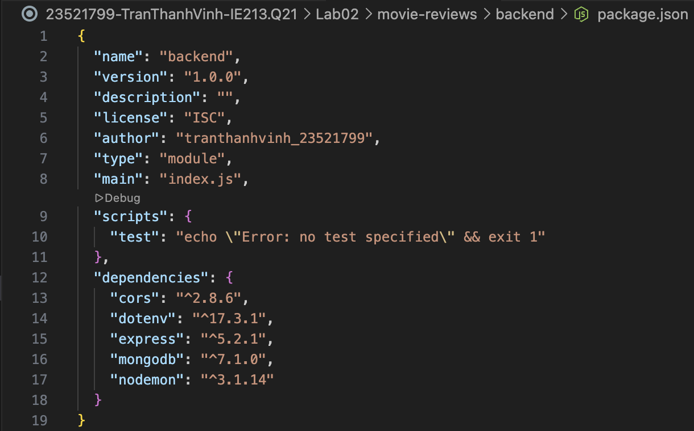
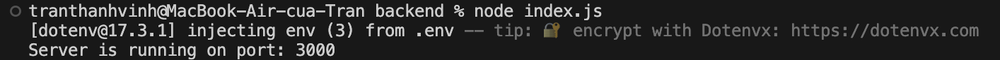
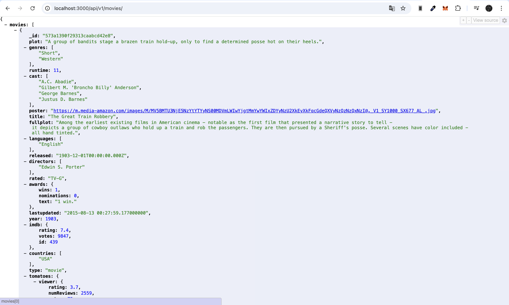
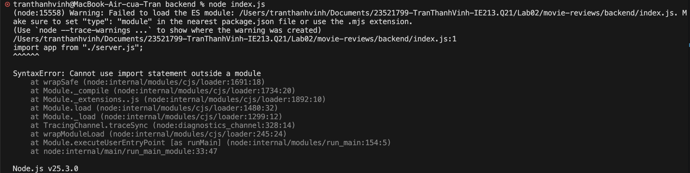
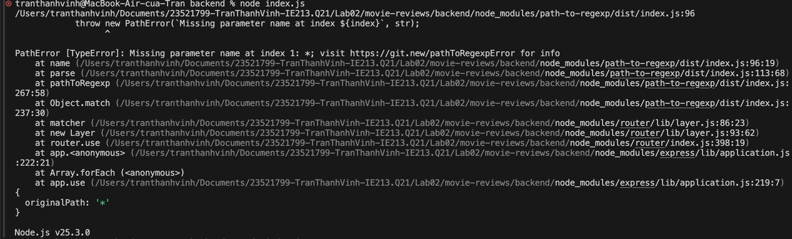

# LAB02 – Thiết lập Backend với NodeJS / ExpressJS

- ### Mục tiêu bài thực hành:
    + Thiết lập môi trường.
    + Thực hành tạo các tệp tin server.js, index.js, api/movies.route.js.

- ### Công cụ / môi trường sử dụng:
    + Node.js
    + Visual Studio Code
    + MongoDb, Express, Cors, Dotenv
    + Nodemon

- ### Những nội dung đã hoàn thành:
    + Khởi tạo dự án Node.js và cài đặt các thư viện cần thiết
    + Thiết lập máy chủ web với `server.js`, xử lý định tuyến cơ bản và lỗi 404
    + Cấu hình biến môi trường qua tệp `.env` để bảo mật thông tin kết nối
    + Kết nối thành công tới MongoDB Atlas thông qua `index.js`
    + Xây dựng `moviesDAO.js` để thực hiện truy vấn dữ liệu có phân trang và bộ lọc
    + Triển khai `movies.controller.js` để tiếp nhận và phản hồi yêu cầu từ máy khách

- ### Những nội dung chưa hoàn thành:
    + Không có

- ### Cách chạy:
    1. Di chuyển vào thư mục backend: cd Lab02/backend
    2. Cài đặt các gói phụ thuộc: npm install
    3. Tạo tệp .env và cấu hình MOVIEREVIEWS_DB_URI cùng PORT
    4. Khởi chạy server: nodemon index.js
    5. Kiểm tra kết quả tại trình duyệt qua địa chỉ: localhost:3000/api/v1/movies

- ### Kết quả đầu ra:
    + **Cài đặt môi trường và thư viện:**
    

    + **Khởi chạy Server và kết nối Database thành công:**
    

    + **Kết quả truy vấn API trên trình duyệt (localhost:3000):**
    

- ### Giải thích ngắn gọn phần chính đã thực hiện:
    + Khởi tạo dự án Node.js và cài đặt các thư viện cần thiết (`express`, `cors`, `dotenv`, `mongodb`).
    + Cấu hình biến môi trường trong tệp `.env` để bảo mật chuỗi kết nối tới cơ sở dữ liệu MongoDB Atlas.
    + Xây dựng kiến trúc Backend phân lớp cơ bản gồm: Route, Controller và DAO.
    + Sử dụng DAO để kết nối trực tiếp với collection `movies` trên MongoDB Atlas và thực hiện truy vấn dữ liệu (kết hợp `find`, `limit`, `skip`).
    + Thiết lập máy chủ Express (`server.js`, `index.js`) để lắng nghe cổng 3000, xử lý lỗi 404 và trả về dữ liệu danh sách phim dưới định dạng JSON cho máy khách.

- ### Sử dụng AI:
    + Công cụ: Gemini
    + Mục đích sử dụng: Nhờ AI giải thích nguyên nhân và cách gỡ lỗi do code trong tài liệu hướng dẫn sử dụng cú pháp/phiên bản cũ.
    + Phần nào được AI hỗ trợ: 
        1. **Lỗi `import` module:** Giải thích việc Node.js mặc định dùng chuẩn cũ, cần sửa `"type": "commonjs"` thành `"type": "module"` trong `package.json` để hệ thống hiểu được cú pháp `import` mới trong bài.
        
        2. **Lỗi định tuyến `*`:** Giải thích việc thư viện `express` bản mới nhất đã thay đổi cơ chế, không còn cho phép dùng dấu `*` đứng độc lập để bắt lỗi 404. Hướng dẫn xóa dấu `*` trong `app.use()` để code chạy đúng chuẩn hiện tại.
        