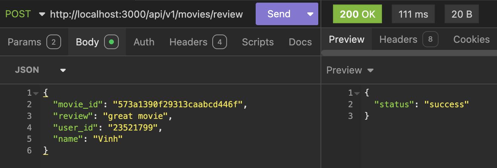
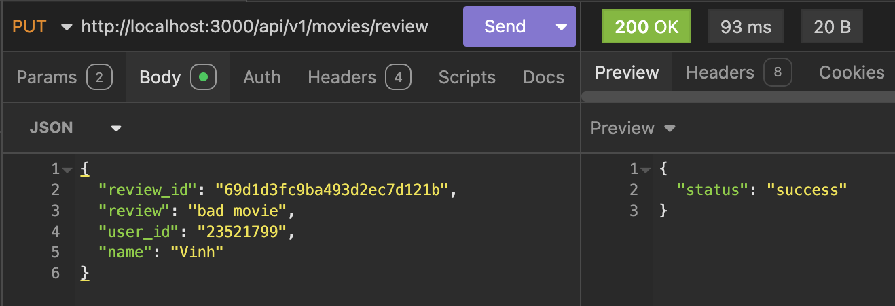
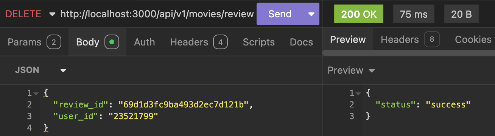
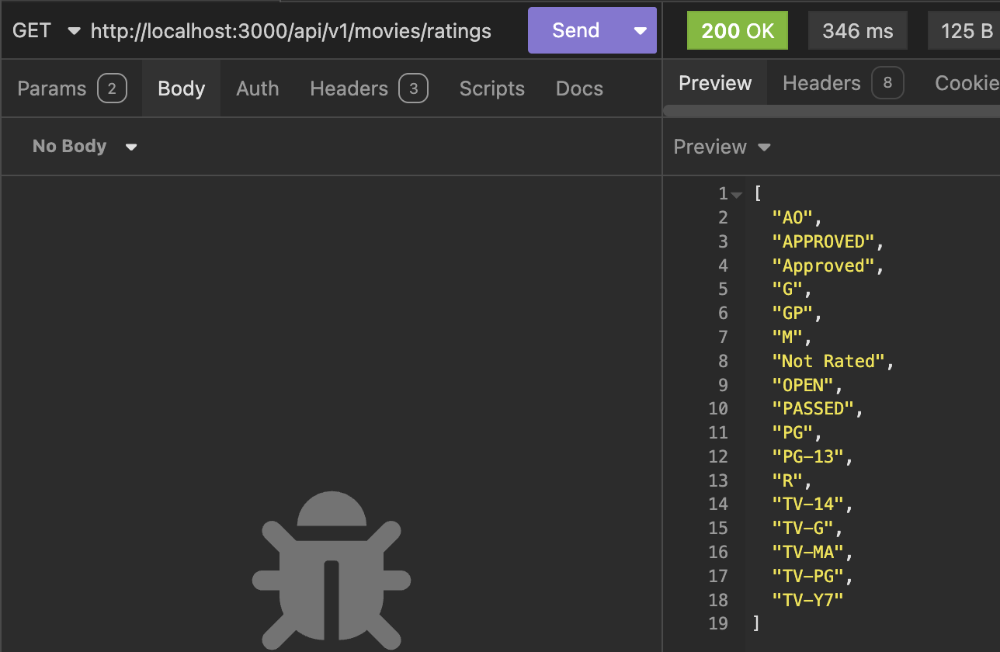
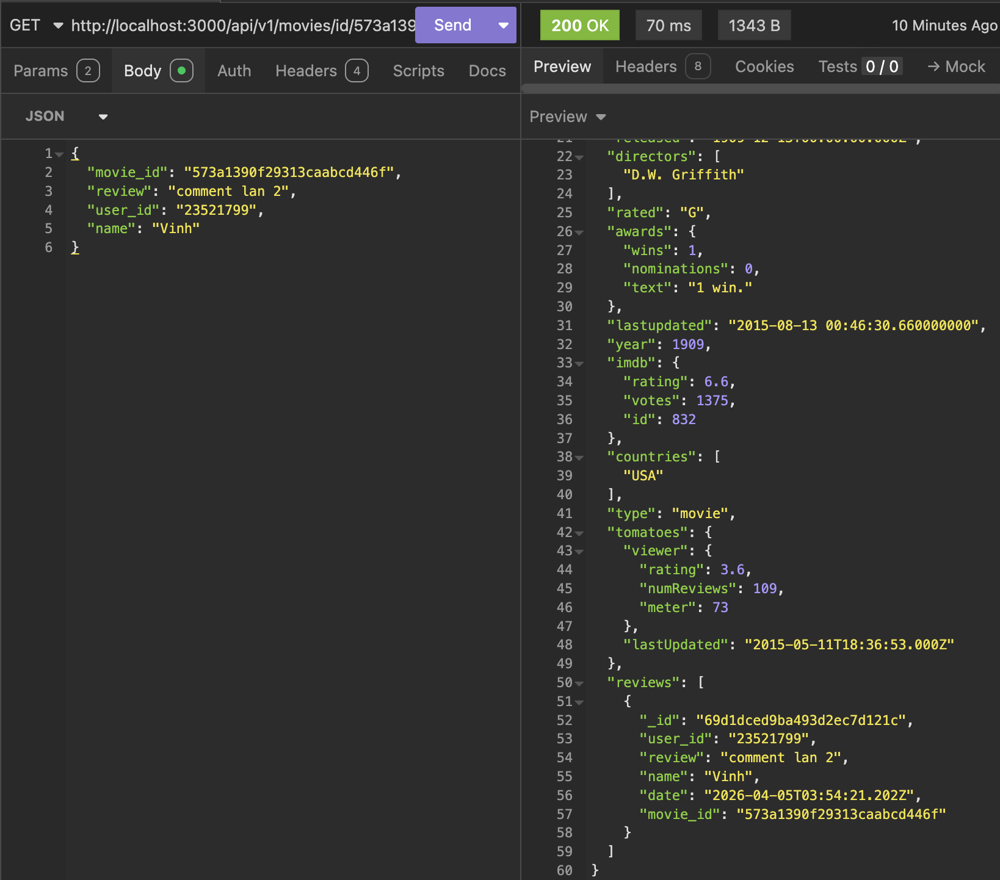

# LAB03 – Hoàn thiện Back-end cho ứng dụng minh hoạ

- ### Mục tiêu bài thực hành:
    + Giúp sinh viên hiểu được sâu sắc cách kết nối giữa các phần Controller,
    Router, Data Access Object trong việc xây dựng mã nguồn.
    + Giới thiệu một số phương thức trong việc gửi yêu cầu dưới dạng http từ máy
    khách lên máy chủ.
    + Thực hành tạo các tệp tin movies.controller.js, reviewDAO,
    reviews.controller.js

- ### Công cụ / môi trường sử dụng:
    + Node.js
    + Visual Studio Code
    + MongoDb, Express, Cors, Dotenv
    + Nodemon
    + Insomnia

- ### Những nội dung đã hoàn thành:
    + Thiết lập định tuyến (Router) cho các thao tác thêm, sửa, xóa review.
    + Hoàn thiện `reviews.controller.js` để tiếp nhận và xử lý yêu cầu liên quan đến review từ client.
    + Xây dựng `reviewsDAO.js` để thực hiện các thao tác CRUD trực tiếp với collection `reviews` trên MongoDB.
    + Bổ sung định tuyến và hàm xử lý trong `moviesDAO.js`, `movies.controller.js` để lấy chi tiết phim theo ID và lấy danh sách phân loại.
    + Khởi tạo kết nối collection `reviews` trong `index.js`.
    + Kiểm thử thành công toàn bộ các API Backend bằng phần mềm Insomnia.

- ### Những nội dung chưa hoàn thành:
    + Không có

- ### Cách chạy:
    1. Mở Terminal và di chuyển vào thư mục backend: `cd Lab03/movie-reviews/backend`
    2. Cài đặt các gói phụ thuộc: `npm install`
    3. Kiểm tra tệp `.env` đảm bảo đã cấu hình `MOVIEREVIEWS_DB_URI` và `PORT=3000`.
    4. Khởi chạy server: `npx nodemon index.js`
    5. Mở phần mềm Insomnia để thực hiện test các endpoint API 

- ### Kết quả đầu ra:
    + **Test API thêm review:**
    

    + **Test API sửa review:**
    

    + **Test API xoá review:**
    

    + **Test API lấy danh sách ratings:**
    

    + **Test API lấy chi tiết phim theo ID:**
    

- ### Giải thích ngắn gọn phần chính đã thực hiện:
    + **Xử lý API Review:** Tiếp nhận dữ liệu JSON từ request body (`movie_id`, `user_id`, `review`, `name`), tạo biến thời gian thực và gọi DAO để đẩy lên Database.
    + **Thao tác MongoDB:** Sử dụng `insertOne()`, `updateOne()`, `deleteOne()` để can thiệp vào dữ liệu collection `reviews`.
    + **Aggregate:** Trong hàm lấy thông tin phim theo ID (`getMovieById`), sử dụng `$match` để tìm phim và `$lookup` để join collection `movies` với `reviews` giúp trả về thông tin phim kèm toàn bộ bình luận.
    + **Distinct:** Dùng phương thức `.distinct("rated")` để quét và trả về mảng các nhãn dán phân loại phim không trùng lặp.

- ### Sử dụng AI:
    + Công cụ: Gemini
    + Mục đích sử dụng: Hỗ trợ kiểm thử API.
    + Phần nào được AI hỗ trợ: 
        1. AI hướng dẫn cách sử dụng API GET để truy xuất chính xác `_id` tự sinh của MongoDB từ bản ghi vừa được POST, từ đó lấy làm tham số đầu vào để thực thi các lệnh PUT và DELETE tiếp theo trên phần mềm Insomnia.