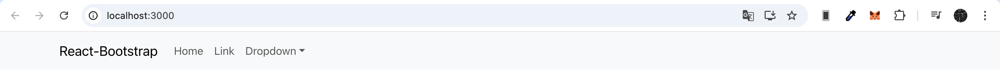
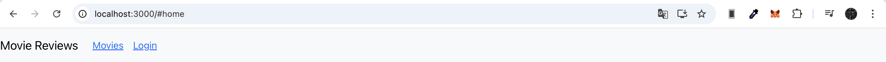
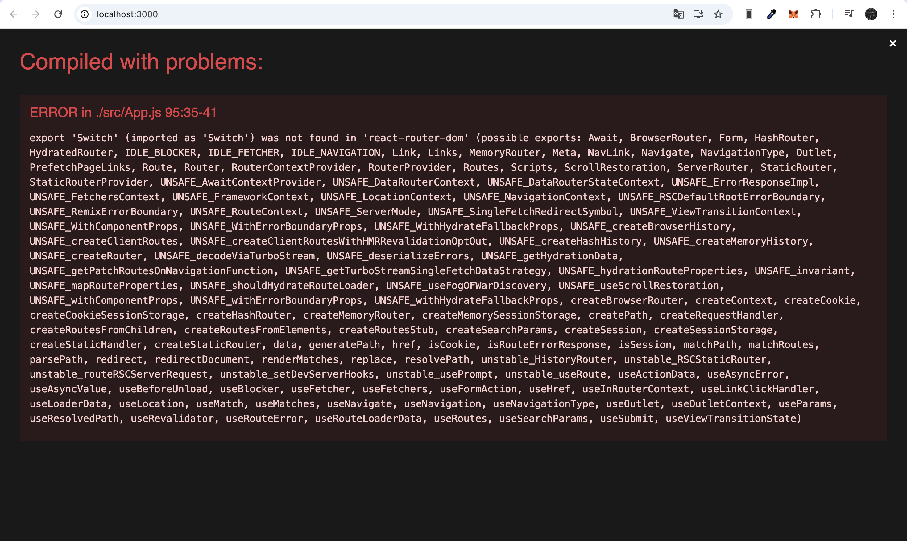
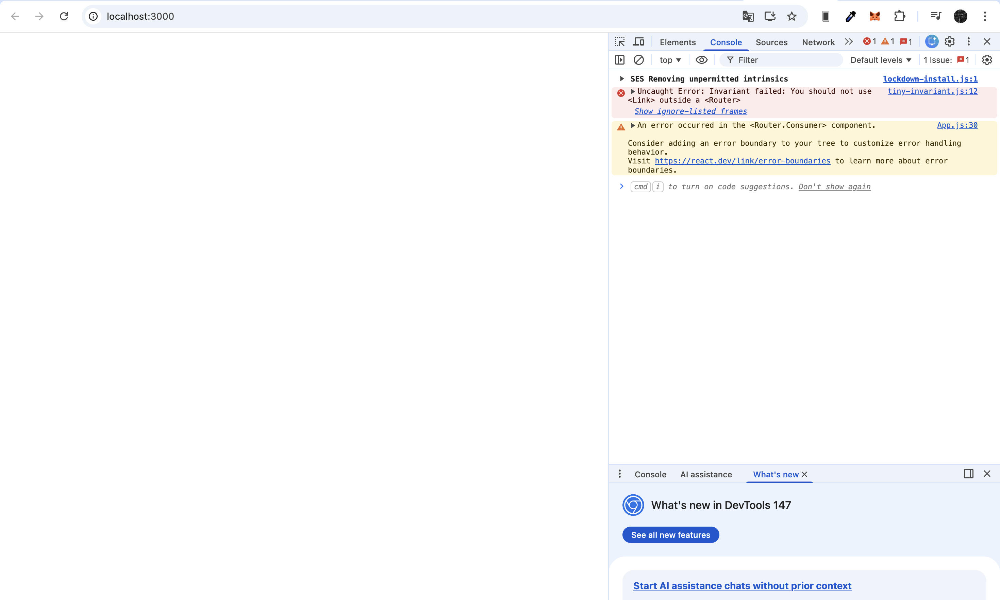

# LAB04 – THIẾT LẬP FRONTEND VỚI REACTJS

- ### Mục tiêu bài thực hành:
    + Giúp sinh viên hiểu được cách thiết lập frontend trong MERN stack với
    Reactjs.
    + Giới thiệu một số package chủ yếu trong việc xây dựng mã nguồn fe.
    + Thực hành xây dựng thanh Navigation Header bar với sự hỗ trợ của
    bootstrap, cách chia các component trong dự án

- ### Công cụ / môi trường sử dụng:
    + Node.js
    + Visual Studio Code
    + ReactJS
    + Thư viện: `react-bootstrap`, `bootstrap`, `react-router-dom`

- ### Những nội dung đã hoàn thành:
    + Hoàn thành Bài 1: Thiết lập nơi làm việc với frontend của dự án.
    + Hoàn thành Bài 2: Xây dựng Navigation Header bar cho ứng dụng.
    + Hoàn thành Bài 3: Thiết lập các định tuyến cho các component vừa tạo ở trên.

- ### Những nội dung chưa hoàn thành:
    + Không có

- ### Cách chạy:
    1. Mở Terminal và di chuyển vào thư mục frontend: `cd frontend`
    2. Cài đặt các gói phụ thuộc: `npm install`
    3. Khởi chạy server: `npm start`

- ### Kết quả đầu ra:
    + **Kết quả lấy Navbar gốc từ React-Bootstrap:**
    

    + **Thanh Navigation khi người dùng chưa đăng nhập:**
    

    + **Thanh Navigation khi người dùng đã đăng nhập:**
    

- ### Giải thích ngắn gọn phần chính đã thực hiện:
    + **Xây dựng UI:** Lấy Navbar Component từ React-Bootstrap đưa vào `App.js` để dựng thanh menu điều hướng.
    + **Quản lý trạng thái:** Sử dụng React hook `useState` để lưu giữ dữ liệu người dùng. Dùng toán tử 3 ngôi kiểm tra biến `user` để render động ra nút "Login" hoặc "Logout User".
    + **Định tuyến:** Thiết lập các đường dẫn URL tương ứng với từng màn hình component bằng thư viện `react-router-dom`.

- ### Sử dụng AI:
    + Công cụ: Gemini
    + Mục đích sử dụng: Hỗ trợ gỡ lỗi và cập nhật cú pháp thư viện mới.
    + Phần nào được AI hỗ trợ: 
        1. Phân tích lỗi `export 'Switch' was not found` và hướng dẫn hạ cấp `react-router-dom` xuống phiên bản `5.3.4` để tương thích với mã nguồn bài lab.
        
        2. Phân tích lỗi `Invariant failed` và hướng dẫn bọc thẻ `<BrowserRouter>` trong file `index.js`.
        