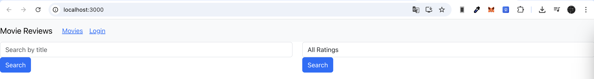
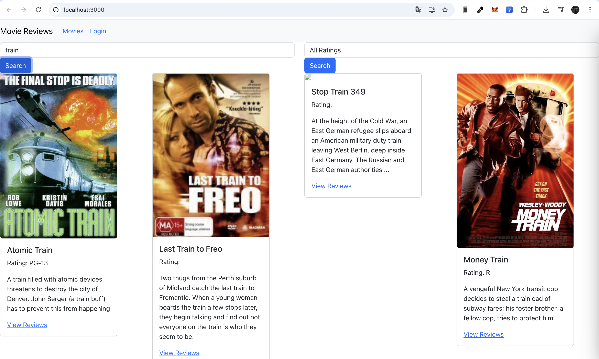
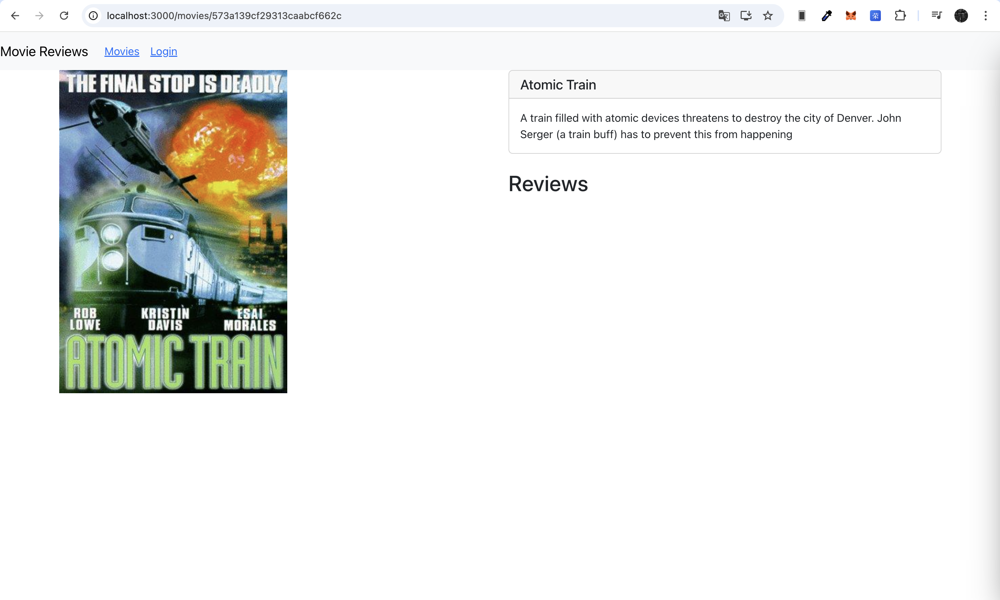
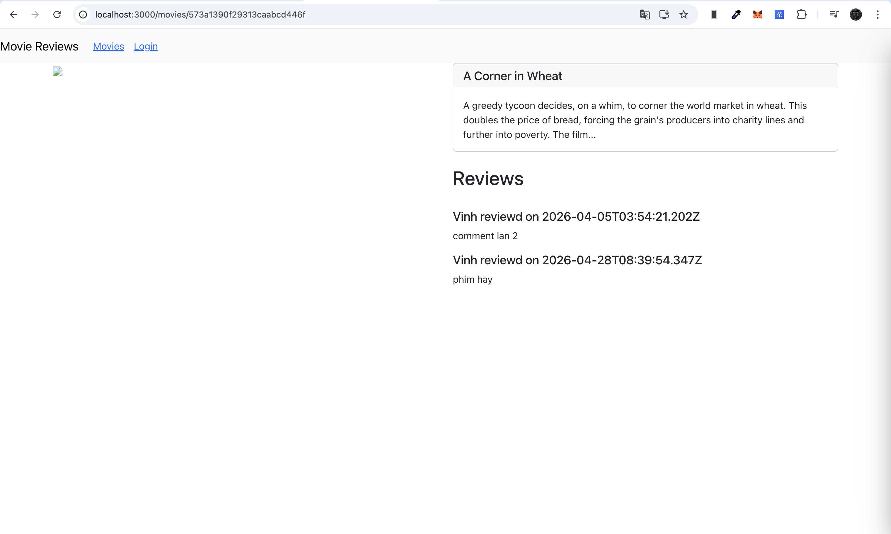
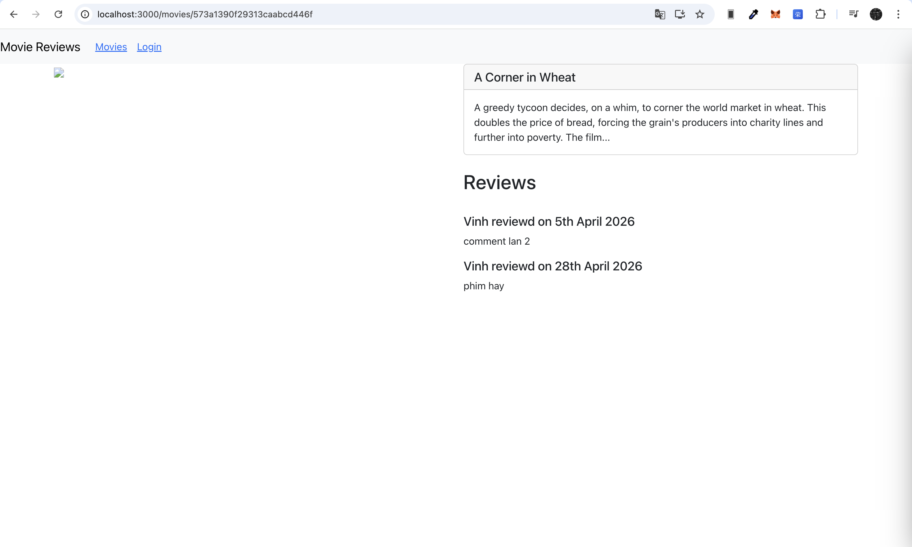
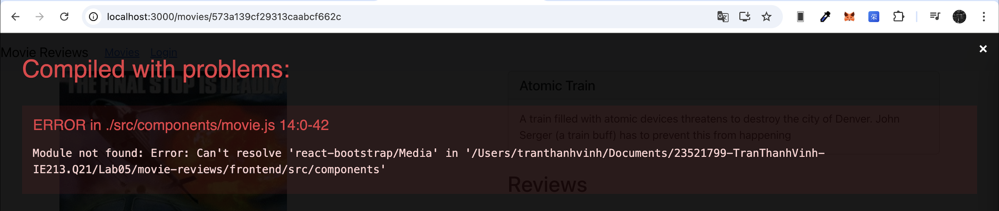

# LAB05 – XÂY DỰNG FRONTEND VỚI REACTJS

- ### Mục tiêu bài thực hành:
    + Giúp sinh viên hiểu được cách kết nối từ fe tới be với reactjs.
    + Giới thiệu một số package chủ yếu trong việc xây dựng mã nguồn fe.
    + Tạo các form để người dùng nhập vào tìm kiếm dữ liệu.
    + Hiển thị danh sách movie thông qua các component của React-bootstrap
    như Card, Link, Switch, Route.
    + Giới thiệu các hook như useState() và useEffect() trong Reactjs.
    + Hiển thị một trang chi tiết về Movie (ứng dụng minh hoạ).
    + Hiển thị các review có liên quan đến Movie.

- ### Công cụ / môi trường sử dụng:
    + Node.js
    + Visual Studio Code
    + ReactJS
    + Thư viện: `react-bootstrap`, `bootstrap`, `react-router-dom`, `axios`, `moment`

- ### Những nội dung đã hoàn thành:
    + Hoàn thành Bài 1: Kết nối tới Backend bằng cách tạo lớp dịch vụ `MovieDataService` sử dụng `axios`.
    + Hoàn thành Bài 2: Xây dựng `MoviesList` Component hiển thị danh sách phim bằng Card và tạo form tìm kiếm (theo tên và rating).
    + Hoàn thành Bài 3: Xây dựng `Movie` Component để hiển thị thông tin chi tiết của một bộ phim khi click vào "View Reviews".
    + Hoàn thành Bài 4: Hiển thị danh sách review tương ứng cho từng phim và điều chỉnh định dạng thời gian bằng `momentjs`.

- ### Những nội dung chưa hoàn thành:
    + Không có

- ### Cách chạy:
    **1. Chạy Backend Server:**
    + Mở Terminal, di chuyển vào thư mục backend: `cd backend`
    + Khởi chạy server: `node index.js`.

    **2. Chạy Frontend React App:**
    + Mở một Terminal mới, di chuyển vào thư mục frontend: `cd frontend`
    + Cài đặt các gói phụ thuộc (nếu chưa cài): `npm i`
    + Khởi chạy ứng dụng: `npm start`

- ### Kết quả đầu ra:
    + **Giao diện form tìm kiếm cơ bản:**
    

    + **Giao diện danh sách phim hiển thị bằng Card:**
    

    + **Trang chi tiết phim khi nhấn 'View Reviews':**
    

    + **Danh sách review hiển thị ngày tháng gốc chưa format:**
    

    + **Danh sách review đã định dạng ngày tháng bằng momentjs:**
    

- ### Giải thích ngắn gọn phần chính đã thực hiện:
    + **Kết nối API (Axios):** Gom nhóm tất cả các lời gọi API tới backend (GET, POST, PUT, DELETE) vào một Class Service để dễ quản lý và tái sử dụng toàn cục.
    + **Quản lý Vòng đời & State (Hooks):** Sử dụng `useState` để lưu trữ trạng thái dữ liệu (danh sách phim, từ khóa tìm kiếm, đánh giá). Sử dụng `useEffect` để tự động gọi API lấy danh sách phim và rating (`retrieveMovies`, `retrieveRatings`) ngay khi component vừa được render.
    + **Render Giao diện (React-Bootstrap):** Dùng hàm `map()` duyệt mảng dữ liệu trả về từ backend để kết xuất ra giao diện dưới dạng các component dựng sẵn như `<Card>`, `<Form.Control>`, `<Row>`, `<Col>`. Xử lý định dạng thời gian bằng thư viện `momentjs`.

- ### Sử dụng AI:
    + Công cụ: Gemini
    + Mục đích sử dụng: Hỗ trợ gỡ lỗi.
    + Phần nào được AI hỗ trợ: 
        1. Phát hiện lỗi biên dịch `Can't resolve 'react-bootstrap/Media'` và đưa ra giải pháp dùng thẻ `
` thay thế do component `<Media>` đã bị loại bỏ ở các phiên bản React-Bootstrap mới.
        