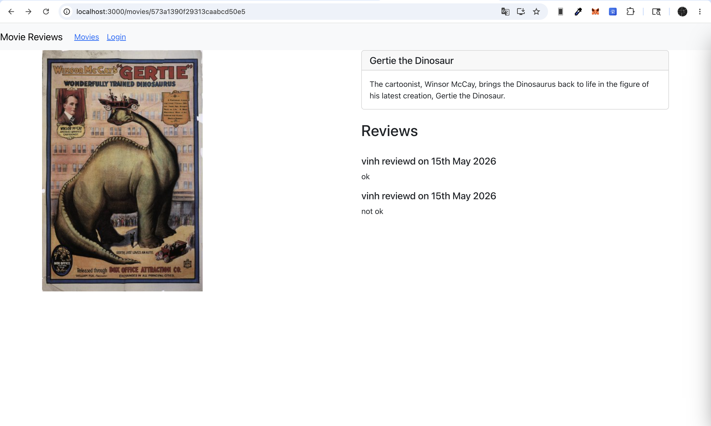
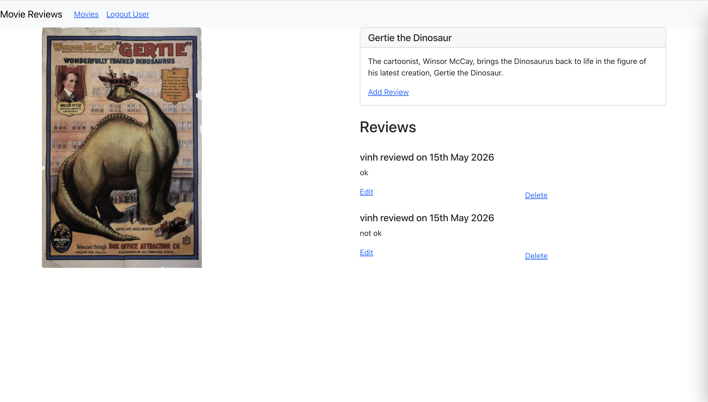
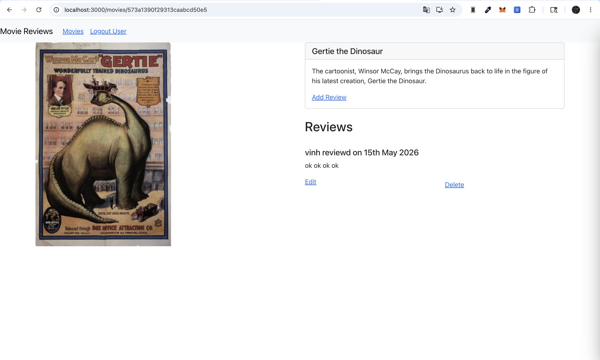
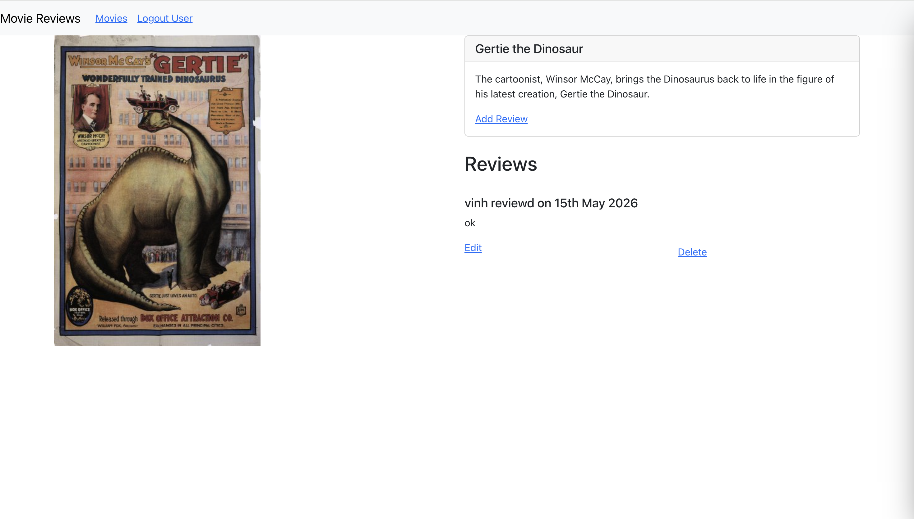
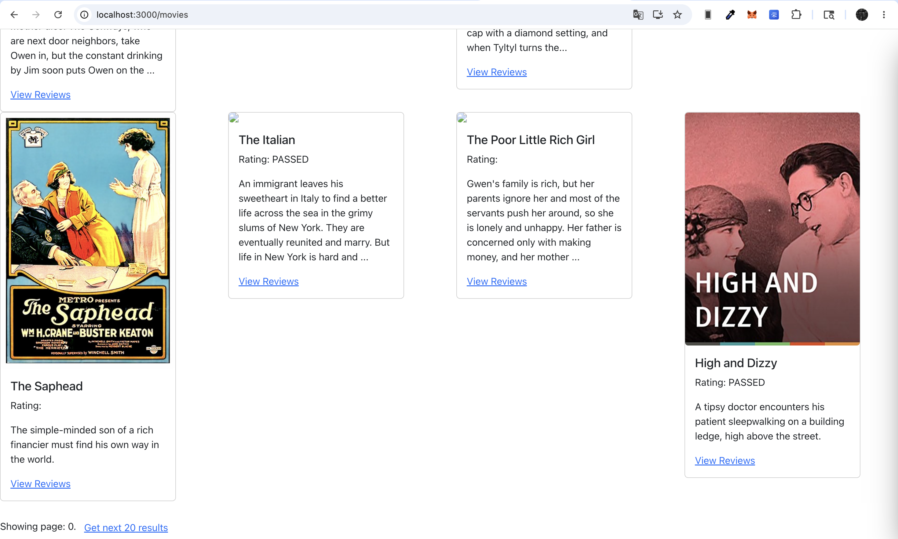
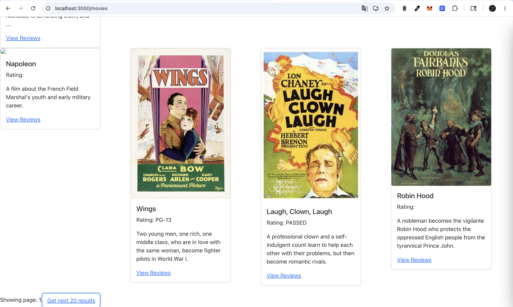
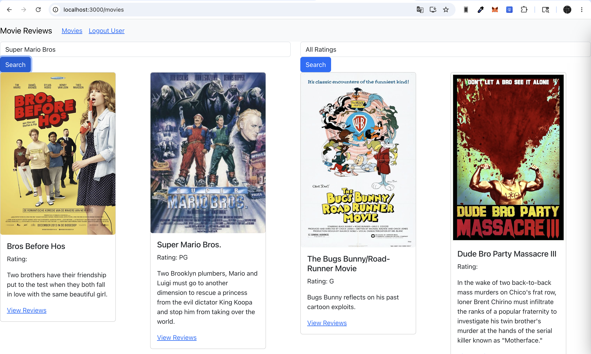
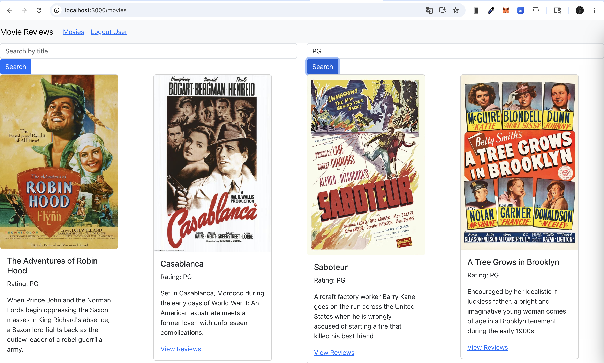

# LAB06 – XÂY DỰNG FRONTEND VỚI REACTJS(tt)

- ### Mục tiêu bài thực hành:
    Giúp sinh viên hiểu cách MERN stack hoạt động thông qua một số sự kiện
    như:
    - Thêm/Xoá/Sửa review từ frontend.
    - Lấy dữ liệu movie theo từng trang, và theo các tiêu chí tìm kiếm như dùng
    Title, Rating.

- ### Công cụ / môi trường sử dụng:
    + Node.js
    + Visual Studio Code
    + ReactJS
    + Thư viện: `react-bootstrap`, `bootstrap`, `react-router-dom`, `axios`, `moment`

- ### Những nội dung đã hoàn thành:
    + Hoàn thành Bài 1: Tạo Login component mô phỏng đăng nhập để phân quyền hiển thị. Xây dựng chức năng Thêm mới và Cập nhật Review.
    + Hoàn thành Bài 2: Tích hợp chức năng Xoá Review, tự động cập nhật lại giao diện sau khi xoá.
    + Hoàn thành Bài 3: Bổ sung chức năng Phân trang để lấy dữ liệu cho trang tiếp theo (áp dụng cho cả danh sách mặc định và khi dùng bộ lọc tìm kiếm).

- ### Những nội dung chưa hoàn thành:
    + Không có

- ### Cách chạy:
    **1. Chạy Backend Server:**
    + Mở Terminal, di chuyển vào thư mục backend: `cd backend`
    + Khởi chạy server: `node index.js`.

    **2. Chạy Frontend React App:**
    + Mở một Terminal mới, di chuyển vào thư mục frontend: `cd frontend`
    + Cài đặt các gói phụ thuộc (nếu chưa cài): `npm i`
    + Khởi chạy ứng dụng: `npm start`

- ### Kết quả đầu ra:
    + **Giao diện chi tiết phim khi chưa đăng nhập:**
    

    + **Giao diện khi đăng nhập đúng tài khoản:**
    

    + **Chức năng Sửa Review cập nhật thành công:**
    

    + **Chức năng Xoá Review xóa thành công:**
    

    + **Chức năng phân trang - Hiển thị trang đầu tiên:**
    

    + **Chức năng phân trang - Load dữ liệu trang tiếp theo:**
    

    + **Chức năng tìm kiếm phim theo Title:**
    

    + **Chức năng tìm kiếm phim theo Rating:**
    

- ### Giải thích ngắn gọn phần chính đã thực hiện:
    + **Phân quyền hiển thị:** Lưu thông tin user mô phỏng vào state thông qua form Login. Ở giao diện hiển thị Review, so sánh user.id đang đăng nhập với user_id của từng bài review để quyết định việc ẩn/hiện hai nút chức năng Edit và Delete.
    + **Xử lý API Thêm/Sửa/Xoá:** Gọi các API POST, PUT, DELETE tương ứng thông qua MovieDataService. Khi xoá dữ liệu, sử dụng splice để cắt trực tiếp phần tử review ra khỏi mảng state hiện tại, giúp UI phản hồi ngay lập tức mà không cần fetch lại toàn bộ dữ liệu.
    + **Quản lý State Phân trang:** Sử dụng useEffect lắng nghe sự thay đổi của currentPage. Mỗi khi người dùng bấm lấy thêm kết quả, biến currentPage tăng lên, kích hoạt gọi lại API (getAll hoặc find) truyền kèm số trang tương ứng để lấy dữ liệu mới. Bổ sung state currentSearchMode để reset trang về 0 mỗi khi đổi qua lại giữa các chế độ tìm kiếm, tránh lỗi sai lệch trang.

- ### Sử dụng AI:
    + Công cụ: Gemini
    + Mục đích sử dụng: Phân tích và hiểu rõ luồng hoạt động của React Hooks.
    + Phần nào được AI hỗ trợ: 
        1. Giải thích chi tiết cơ chế hoạt động của Hook useEffect khi kết hợp với các biến state như currentPage và currentSearchMode. Phân tích cách React quản lý vòng đời component và tự động gọi API lấy dữ liệu mới khi thay đổi trang.